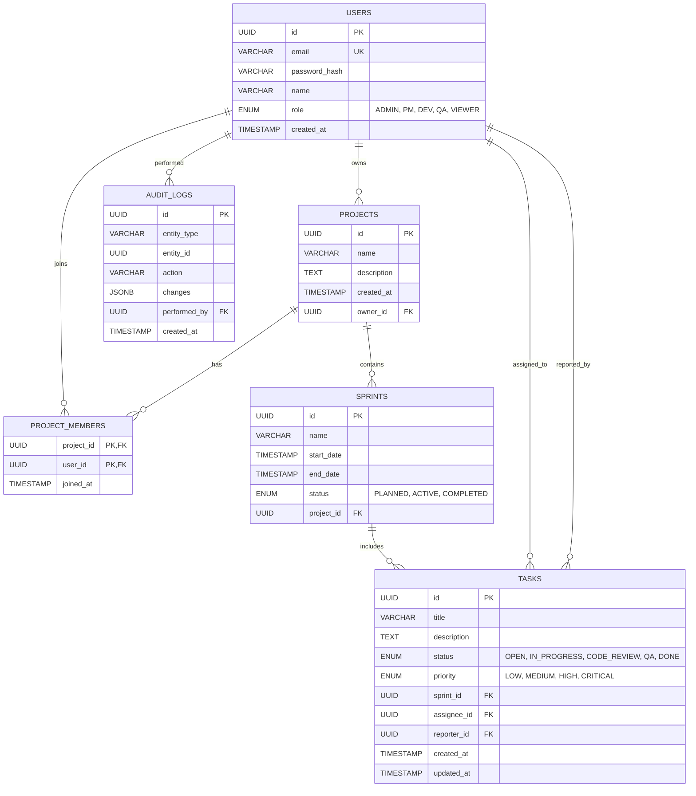

```mermaid
erDiagram
    USERS {
        UUID id PK
        VARCHAR email UK
        VARCHAR password_hash
        VARCHAR name
        ENUM role "ADMIN, PM, DEV, QA, VIEWER"
        TIMESTAMP created_at
    }

    PROJECTS {
        UUID id PK
        VARCHAR name
        TEXT description
        TIMESTAMP created_at
        UUID owner_id FK
    }

    PROJECT_MEMBERS {
        UUID project_id PK, FK
        UUID user_id PK, FK
        TIMESTAMP joined_at
    }

    SPRINTS {
        UUID id PK
        VARCHAR name
        TIMESTAMP start_date
        TIMESTAMP end_date
        ENUM status "PLANNED, ACTIVE, COMPLETED"
        UUID project_id FK
    }

    TASKS {
        UUID id PK
        VARCHAR title
        TEXT description
        ENUM status "OPEN, IN_PROGRESS, CODE_REVIEW, QA, DONE"
        ENUM priority "LOW, MEDIUM, HIGH, CRITICAL"
        UUID sprint_id FK
        UUID assignee_id FK
        UUID reporter_id FK
        TIMESTAMP created_at
        TIMESTAMP updated_at
    }

    AUDIT_LOGS {
        UUID id PK
        VARCHAR entity_type
        UUID entity_id
        VARCHAR action
        JSONB changes
        UUID performed_by FK
        TIMESTAMP created_at
    }

    USERS ||--o{ PROJECTS : "owns"
    USERS ||--o{ PROJECT_MEMBERS : "joins"
    PROJECTS ||--o{ PROJECT_MEMBERS : "has"
    PROJECTS ||--o{ SPRINTS : "contains"
    SPRINTS ||--o{ TASKS : "includes"
    USERS ||--o{ TASKS : "assigned_to"
    USERS ||--o{ TASKS : "reported_by"
    USERS ||--o{ AUDIT_LOGS : "performed"
```
