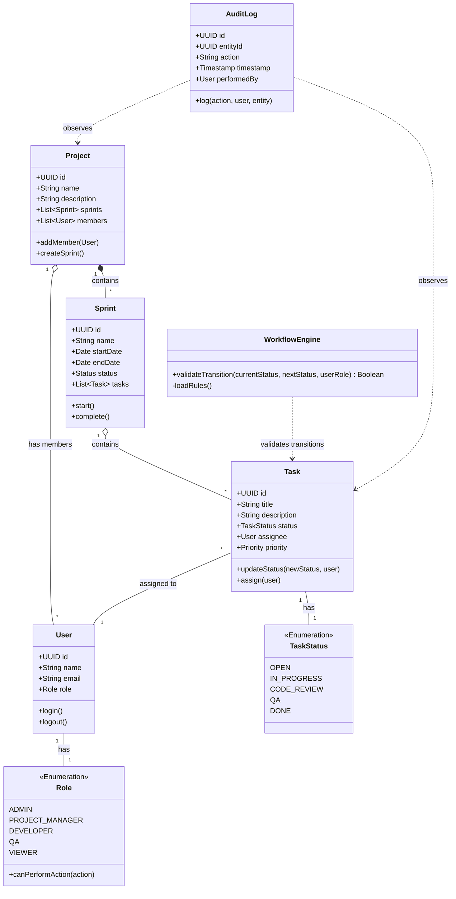

```mermaid
classDiagram
    class User {
        +UUID id
        +String name
        +String email
        +Role role
        +login()
        +logout()
    }

    class Role {
        <<Enumeration>>
        ADMIN
        PROJECT_MANAGER
        DEVELOPER
        QA
        VIEWER
        +canPerformAction(action)
    }

    class Project {
        +UUID id
        +String name
        +String description
        +List~Sprint~ sprints
        +List~User~ members
        +addMember(User)
        +createSprint()
    }

    class Sprint {
        +UUID id
        +String name
        +Date startDate
        +Date endDate
        +Status status
        +List~Task~ tasks
        +start()
        +complete()
    }

    class Task {
        +UUID id
        +String title
        +String description
        +TaskStatus status
        +User assignee
        +Priority priority
        +updateStatus(newStatus, user)
        +assign(user)
    }

    class TaskStatus {
        <<Enumeration>>
        OPEN
        IN_PROGRESS
        CODE_REVIEW
        QA
        DONE
    }

    class WorkflowEngine {
        +validateTransition(currentStatus, nextStatus, userRole) Boolean
        -loadRules()
    }

    class AuditLog {
        +UUID id
        +UUID entityId
        +String action
        +Timestamp timestamp
        +User performedBy
        +log(action, user, entity)
    }

    User "1" -- "1" Role : has
    Project "1" *-- "*" Sprint : contains
    Project "1" o-- "*" User : has members
    Sprint "1" o-- "*" Task : contains
    Task "*" -- "1" User : assigned to
    Task "1" -- "1" TaskStatus : has
    
    WorkflowEngine ..> Task : validates transitions
    AuditLog ..> Task : observes
    AuditLog ..> Project : observes
```
