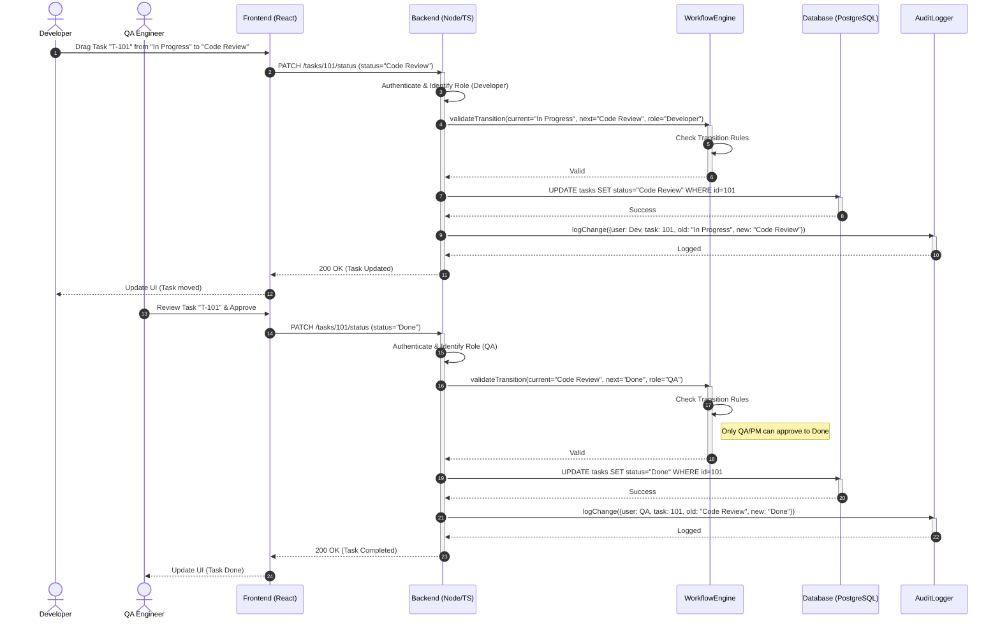

```mermaid
sequenceDiagram
    autonumber
    actor Dev as Developer
    actor QA as QA Engineer
    participant FE as Frontend (React)
    participant API as Backend (Node/TS)
    participant Engine as WorkflowEngine
    participant DB as Database (PostgreSQL)
    participant Logger as AuditLogger

    %% Developer moving task to Code Review
    Dev->>FE: Drag Task "T-101" from "In Progress" to "Code Review"
    FE->>API: PATCH /tasks/101/status (status="Code Review")
    activate API
    
    API->>API: Authenticate & Identify Role (Developer)
    
    API->>Engine: validateTransition(current="In Progress", next="Code Review", role="Developer")
    activate Engine
    Engine->>Engine: Check Transition Rules
    Engine-->>API: Valid
    deactivate Engine

    API->>DB: UPDATE tasks SET status="Code Review" WHERE id=101
    activate DB
    DB-->>API: Success
    deactivate DB

    API->>Logger: logChange({user: Dev, task: 101, old: "In Progress", new: "Code Review"})
    activate Logger
    Logger-->>API: Logged
    deactivate Logger

    API-->>FE: 200 OK (Task Updated)
    deactivate API
    FE-->>Dev: Update UI (Task moved)

    %% QA moving task to Done
    QA->>FE: Review Task "T-101" & Approve
    FE->>API: PATCH /tasks/101/status (status="Done")
    activate API

    API->>API: Authenticate & Identify Role (QA)

    API->>Engine: validateTransition(current="Code Review", next="Done", role="QA")
    activate Engine
    Engine->>Engine: Check Transition Rules
    note right of Engine: Only QA/PM can approve to Done
    Engine-->>API: Valid
    deactivate Engine

    API->>DB: UPDATE tasks SET status="Done" WHERE id=101
    activate DB
    DB-->>API: Success
    deactivate DB

    API->>Logger: logChange({user: QA, task: 101, old: "Code Review", new: "Done"})
    activate Logger
    Logger-->>API: Logged
    deactivate Logger

    API-->>FE: 200 OK (Task Completed)
    deactivate API
    FE-->>QA: Update UI (Task Done)
```
