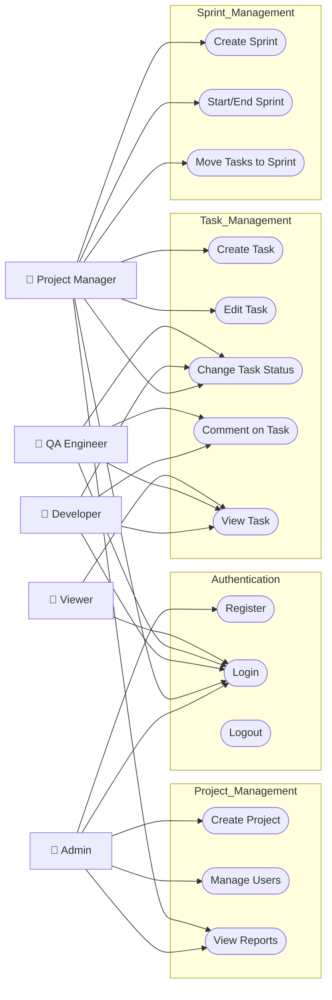

# Nexus Use Case Diagram

```mermaid
flowchart LR
    %% Actors
    Admin["👤 Admin"]
    PM["👤 Project Manager"]
    Developer["👤 Developer"]
    QA["👤 QA Engineer"]
    Viewer["👤 Viewer"]

    %% Use Case Packages
    subgraph Authentication
        UC0(["Register"])
        UC1(["Login"])
        UC2(["Logout"])
    end

    subgraph Project_Management
        UC3(["Create Project"])
        UC4(["Manage Users"])
        UC5(["View Reports"])
    end

    subgraph Sprint_Management
        UC6(["Create Sprint"])
        UC7(["Start/End Sprint"])
        UC8(["Move Tasks to Sprint"])
    end

    subgraph Task_Management
        UC9(["Create Task"])
        UC10(["Edit Task"])
        UC11(["Change Task Status"])
        UC12(["Comment on Task"])
        UC13(["View Task"])
    end

    %% Relationships
    Admin --> UC0
    Admin --> UC1
    Admin --> UC3
    Admin --> UC4
    Admin --> UC5

    PM --> UC1
    PM --> UC6
    PM --> UC7
    PM --> UC8
    PM --> UC9
    PM --> UC10
    PM --> UC11
    PM --> UC5

    Developer --> UC1
    Developer --> UC11
    Developer --> UC12
    Developer --> UC13

    QA --> UC1
    QA --> UC11
    QA --> UC12
    QA --> UC13

    Viewer --> UC1
    Viewer --> UC13

    %% Styling for Use Case shape
    classDef usecase fill:#fff,stroke:#333,stroke-width:2px,rx:10,ry:10;
```
